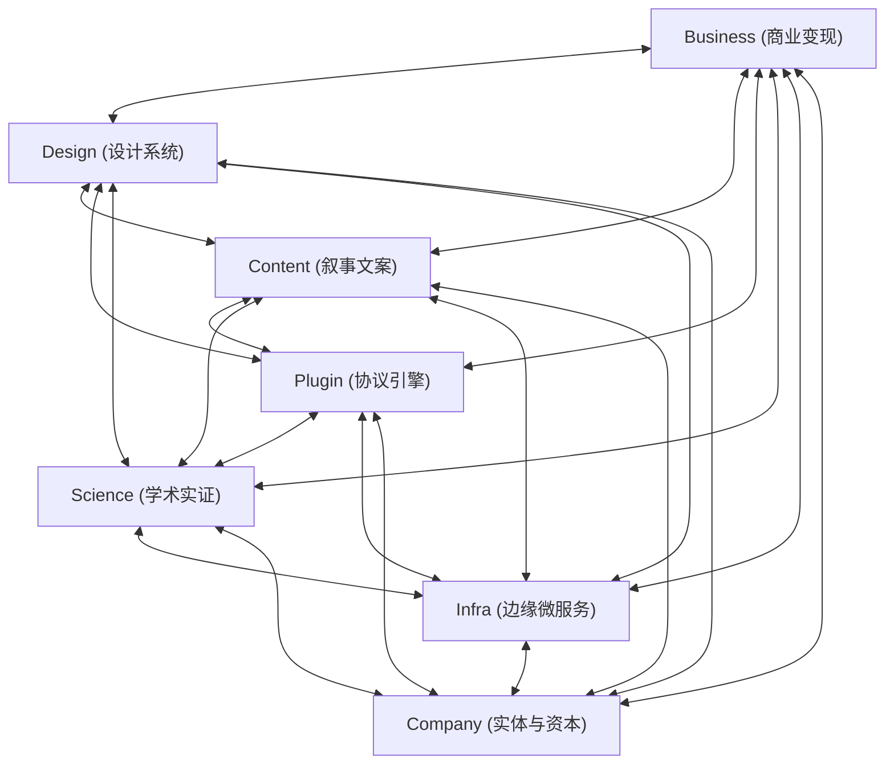

# Master Heptagonal Interlocking Flywheel Governance (`flywheel`)

> **全域治理元法则 (Core Governance Axiom)**：
> **减少熵增 (Anti-Entropy) · 增加复利 (Compounding Returns)**。
> 工作本质是对复杂系统的持续治理。拒绝一次性消耗型劳动，每一个改动都必须注入 $K_7$ 互为飞轮网络，在时间维度上持续产生加速度与复利。

---

## 1. 🏛️ 一级目录七维完全图拓扑 ($K_7$ Complete Directed Graph)

7 大一级独立领域仓库构成互为因果、相互复利的有向完全图（$K_7$ Topology，涵盖 $7 \times 6 = 42$ 条动量传导回路）：



---

## 2. 🌀 42 条全域动量回路清单 (The 42 Momentum Channels)

| 通道 ID | 发起 ➔ 目标 | 动量通道名称 | 核心传递价值与机制 | 实证校验标准 |
| :--- | :--- | :--- | :--- | :--- |
| **`BIZ_SCI`** | `Business` ➔ `Science` | **实证数据之源** | 匿名真实用户行为轨迹、测量分布与纵向 A/B 试验，为计算社会学提供大样本实证基石。 | `Science/Paper/` 包含实证测度论文 |
| **`BIZ_DES`** | `Business` ➔ `Design` | **真实场景淬炼** | 商业高压转化漏斗与极端断点交互挑战，倒逼设计系统提炼更高泛化能力的 Svelte 5 原语。 | `Business/` 各赛道产品高压测试 |
| **`BIZ_CNT`** | `Business` ➔ `Content` | **精准痛点画像** | 转化率数据、付费客群画像与高频跳出痛点，为内容团队提供真实的心理动因与故事素材。 | `Content/Marketing/Copy/` 转化文案库 |
| **`BIZ_PLG`** | `Business` ➔ `Plugin` | **业务需求抽象** | 运营中的重复劳动（获客、竞对追踪、账单对账）抽象固化为标准 MCP 工具与 DAG 节点。 | `Plugin/Domain/Business/` 8 阶段生命周期 |
| **`BIZ_INF`** | `Business` ➔ `Infra` | **生产流量注入** | 生产级用户会话与真实支付结算流量注入边缘微服务，提供持续负载与弹性压测。 | 前端服务客户端直接绑定 `Infra/Monetization` |
| **`BIZ_CMP`** | `Business` ➔ `Company` | **商业价值反哺** | 真实商业流水、付费订阅收入与现金流反哺母公司企业估值与资本储备。 | 产品商业定价阶梯健全 |
| **`SCI_BIZ`** | `Science` ➔ `Business` | **不可撼动的信任** | 顶刊同行评审（APA/JMIR）、IRB 伦理、CARF/MBC 认证与专利背书，击穿用户与机构付费阻力。 | 权威学术资质与质控徽章上屏 |
| **`SCI_CNT`** | `Science` ➔ `Content` | **硬核真理锚点** | 经同行评审检验的科学事实与机制模型，作为深度科普、硬核爆款故事与高信度文案的真理锚。 | 科研实证数据支撑文案真理锚点 |
| **`SCI_DES`** | `Science` ➔ `Design` | **认知工效学依据** | 眼动规律、注意广度与认知负荷定量结论，指导 OKLCH 色彩对比度、留白节奏与排版微调。 | 认知负荷与科研图表组件上线 |
| **`SCI_PLG`** | `Science` ➔ `Plugin` | **严谨算法红线** | 心理量表评分算法（GAD-7/PHQ-9）、危机干预红线与专利先验算法，直接封装为核心算子。 | `Plugin/Domain/Science/` 严谨算法封装 |
| **`SCI_INF`** | `Science` ➔ `Infra` | **算法合规红线** | 临床伦理标准、去标识化规则与脱敏规范直接固化为边缘数据存储与留存的物理策略。 | 医疗与伦理合规逻辑写入微服务 |
| **`SCI_CMP`** | `Science` ➔ `Company` | **无形资产沉淀** | 学术论文手稿与科研成果沉淀为法人主体的核心知识产权与专利资产储备。 | `Science/Paper/` 与 `Company/Patent/` 资产目录 |
| **`CNT_BIZ`** | `Content` ➔ `Business` | **爆款转化资产** | 15 节拍产品故事、高转化 PAS 文案与 3 秒钩子，直接降低获客成本（CAC），拉升 LTV。 | PAS 框架文案直接赋能商业转化 |
| **`CNT_DES`** | `Content` ➔ `Design` | **品牌调性塑形** | 叙事基调与语言情感温度塑造 Design 的主题氛围（Tokens）、瑞士网格与微交互阻尼感。 | 瑞士排版与情感色阶对齐 |
| **`CNT_SCI`** | `Content` ➔ `Science` | **学术社会化破圈** | 将严密艰深的学术论文转化为通俗的图文摘要与媒体通稿，十倍放大 Altmetric 学术影响力。 | 学术论文公众化科普与图文分发 |
| **`CNT_PLG`** | `Content` ➔ `Plugin` | **结构化文案配方** | 经市场验证的文案结构（PAS, AIDA, StoryBrand）固化为 Plugin/Content 的自动化生成器。 | 15 节拍故事与病毒钩子自动化工具 |
| **`CNT_INF`** | `Content` ➔ `Infra` | **开发者文档体系** | 极高质量的 API 参考指南、故障排查手册与架构全景文档，极大提升服务易用性。 | 开发者文档与微服务指南完备 |
| **`CNT_CMP`** | `Content` ➔ `Company` | **企业叙事传播** | 创始人愿景公开信、年度报告与组织叙事，建立顶级雇主品牌与长期投资者心智共识。 | 品牌故事与企业公开信归档 |
| **`DES_BIZ`** | `Design` ➔ `Business` | **极致质感与转化** | 极简、克制、留白的 60fps 页面级构件库，赋予产品顶级专业感与 0 摩擦体验，缩短 TTV。 | 19 个单单词页面级组件全域消费 |
| **`DES_CNT`** | `Design` ➔ `Content` | **视觉容器与排版** | 丰富的版式模板、信息图表基元（Radar/Spark/Chart）与引用容器，让文字内容高质呈现。 | 图文容器、Callout 与排版组件 |
| **`DES_SCI`** | `Design` ➔ `Science` | **顶刊级高精图表** | 专为学术论文定制的高精数据可视化、矢量图表（Figure）与海报（Poster）展示组件。 | 论文专用高精图表与海报容器 |
| **`DES_PLG`** | `Design` ➔ `Plugin` | **机器可读元数据** | 50+ 组件契约规范、26+ OKLCH 字典与领域预设，暴露为智能体装配 UI 的可检索知识库。 | 50+ 组件及 Tokens 机器可读索引 |
| **`DES_INF`** | `Design` ➔ `Infra` | **控制台规范统领** | 统一的 OKLCH 设计变量、暗色微边框与极简组件库，直接统治所有边缘控制台与内部工具。 | 规范 Tokens 统领控制台 UI |
| **`DES_CMP`** | `Design` ➔ `Company` | **品牌视觉资产** | 高管演讲 Deck、融资路演模板、官方矢量 Logo 规范与法人证书排版，呈现最高国际水准。 | 顶级商务演示与视觉资产完备 |
| **`PLG_BIZ`** | `Plugin` ➔ `Business` | **无人化自主巡航** | 8 阶段商业周期、SEO KD 测算、Stripe 营收分析与多通道自动化执行，支撑 1 人企业运营。 | 自动化运营与收入监控工具就绪 |
| **`PLG_DES`** | `Plugin` ➔ `Design` | **设计守卫与演进** | 自动化设计契约测试、CDP 浏览器视觉走查、无障碍色差校验与组件自动提炼提升脚本。 | 自动化设计走查与组件契约测试 |
| **`PLG_CNT`** | `Plugin` ➔ `Content` | **智能内容流水线** | 自动化 15 节拍故事生成、SEO 关键词长尾矩阵批量拓展与跨平台分发机器人。 | 智能内容生成与分发流水线 |
| **`PLG_SCI`** | `Plugin` ➔ `Science` | **科研自动化加速** | 自动化文献检索、DOI 验证、期刊 IF 匹配与 USPTO/WIPO 专利先验比对，压缩 90% 机械耗时。 | 自动化文献分析与专利校验工具 |
| **`PLG_INF`** | `Plugin` ➔ `Infra` | **探针自动化巡航** | 自动化合成探针（Synthetic Canaries）持续走查所有边缘微服务延迟、可用性与端到端旅程。 | Autopilot 活跃运行边缘合成探针 |
| **`PLG_CMP`** | `Plugin` ➔ `Company` | **合规自动审计** | 自动化股权表核算、法人状态巡查与合规门禁，杜绝任何公司治理法律盲区。 | 公司合规自动化巡检脚本正常 |
| **`INF_BIZ`** | `Infra` ➔ `Business` | **极速服务底座** | 全球边缘微服务统一提供 <15ms 极速鉴权、Google One Tap 免感登入与全球 Stripe 订阅通道。 | 统一 Hono 边缘微服务支撑商业应用 |
| **`INF_PLG`** | `Infra` ➔ `Plugin` | **运行状态透传** | 边缘微服务 OpenAPI 契约实时导出，实时调用事件流反哺 Plugin 智能限流与工具进化。 | 微服务端点与契约规格实时透传 |
| **`INF_SCI`** | `Infra` ➔ `Science` | **高安全数据底座** | 零知识心理测量数据流水线、不可篡改审计日志与端到端加密存储，满足 HIPAA/IRB 物理要求。 | 边缘加密事件日志迁移健全 |
| **`INF_DES`** | `Infra` ➔ `Design` | **边缘性能度量** | 真实的全球边缘往返时延（RTT）、TTFB 与吞吐量指标，直接驱动设计系统的动效调优与骨架屏设计。 | 边缘时延与网络度量脚本在位 |
| **`INF_CMP`** | `Infra` ➔ `Company` | **合规操作留痕** | 不可篡改的访问日志、管理员鉴权追溯记录与资金流水快照，为审计合规提供实证闭环。 | 严格遵循 SOC2 规范的持久化日志 |
| **`INF_CNT`** | `Infra` ➔ `Content` | **可用性硬核背书** | 全球 300+ 边缘节点、99.99% 持续在线率与毫秒级全球加速，成为极具说服力的营销背书。 | 系统状态与全球性能证明点 |
| **`CMP_BIZ`** | `Company` ➔ `Business` | **法人与资金通道** | 提供正规法律主体保护、全球银行账户、Stripe 商户资质与国际合规跨境税务筹划。 | 正规法人主体承载商业运营 |
| **`CMP_SCI`** | `Company` ➔ `Science` | **科研申报资质** | 提供国家自然科学基金、高新技术企业、大学联合实验室与 IRB 伦理申报的正式法人主体资格。 | 实体具备学术与项目申报资质 |
| **`CMP_INF`** | `Company` ➔ `Infra` | **主体资产确权** | 法人主体持有 Cloudflare Enterprise、域名资产、Stripe 账户与云服务所有权，承担法律终局责任。 | 核心主体持有全量云端基础设施 |
| **`CMP_CNT`** | `Company` ➔ `Content` | **创始人真实叙事** | 创始合伙人的真实科研背景、创业初心与伦理承诺，构成最具公信力与人文温度的故事内核。 | 创始人真实经历与履历档案归档 |
| **`CMP_DES`** | `Company` ➔ `Design` | **注册商标规格** | 法人主体持有的官方注册商标、标准矢量母版与法律版权声明，规范视觉呈现合法边界。 | 官方商标矢量规范已固化 |
| **`CMP_PLG`** | `Company` ➔ `Plugin` | **授权凭证下发** | 基于 Mode-0600 的组织级 API 凭据托管、合规操作边界授权与数据安全保护条约。 | 组织级密钥策略严格安全受控 |

---

## 3. 🛡️ 贯穿日常工作的飞轮三铁律 (Three Operational Flywheel Laws)

任何工程师、智能体（Antigravity, Cursor, Jules, Autopilot）在执行任何任务时，必须先过三门：

### 律一：无源之水不流入 (No Orphan Input Law)
* 严禁无来源的随意开发。任何新功能、新组件、新文案的提出，必须明确其上游飞轮输入来源：
  - 前端需求是否来自 `Business` 的明确痛点？
  - 文案主张是否来自 `Science` 的权威实证？
  - 工具能力是否来自高频重复的工程需求？
* 无明确上游动量输入者，视为系统熵增，一律不写。

### 律二：单真理源统一收敛 (Single Source of Truth Law)
* 绝不在业务产品层重复发明轮子：
  - **前端设计统一走 `Design`**：全域所有应用必须直接消费 `@mentalcraft/design-svelte` 导出的单单词组件（`<Landing>`, `<Hero>`, `<Pricing>`, `<Dialog>`）与 OKLCH Tokens。严禁在业务内手写未收敛的裸控件或私有 CSS。
  - **后端微服务统一走 `Infra`**：用户鉴权、支付计费、事件埋点、分布式 KV/D1 数据库必须 100% 收敛于 `Infra/`（TypeScript + Hono 边缘微服务）。严禁任何业务端自建私有后端或重复手写孤岛逻辑。
  - **工具与自动化统一走 `Plugin`**：自动化运维、探针巡检、浏览器控制全部封装为 FastMCP 标准工具，零宿主依赖。
  - **科研红线统一走 `Science`**：专业量表计算、伦理红线、数据脱敏算法统一定义于学术端。
  - **法人资产统一走 `Company`**：银行账户、域名主体、API 机构密钥统一收敛于公司治理域。
  - **故事传播统一走 `Content`**：爆款文案配方、品牌公关信由内容域统领。

### 律三：离开必留复利沉淀 (Compounding Footprint Law)
* 拒绝一次性消耗型劳动。任何任务交付时，必须至少为一个下游领域注入可复用的生产要素：
  - 业务中验证有效的新 UI 范式？➔ **必须抽离抽象为单单词组件沉淀至 `Design`**。
  - 排查修复了某个边缘微服务缺陷？➔ **必须将合成用例固化至 `Plugin` 自动化探针**。
  - 优化了产品高转化文案？➔ **必须将文案配方沉淀回 `Content` 营销资产库**。
  - 积累了关键用户交互样本？➔ **必须将脱敏数据反哺至 `Science` 实证论文**。
* 离开时让系统秩序度高于进入时，制造全域复利。

---

## 4. 🚀 自动化连通度巡检门禁 (Automated Governance Verification)

全域动量回路必须保持 100% 实时连通，任何代码提交前必须执行双重门禁：

```bash
# 1. 巡检全域 7 维 42 通道飞轮连通度及 $K_7$ 邻接矩阵 (必须 42/42 100% 绿灯)
bun Plugin/.agents/scripts/check-flywheel.ts

# 2. 生成 Markdown 格式的跨域飞轮记分卡 (用于 CI 汇总或 PR 审查)
bun Plugin/.agents/scripts/check-flywheel.ts --markdown

# 3. 针对特定领域快速过滤审查 (如 Infra 的 12 条输入输出回路)
bun Plugin/.agents/scripts/check-flywheel.ts --domain=Infra

# 4. 运行全域统一 9 大主门禁 (涵盖跨域飞轮、代码合规、设计系统契约、微服务健康等)
bun Plugin/.agents/scripts/verify-all.ts
```

