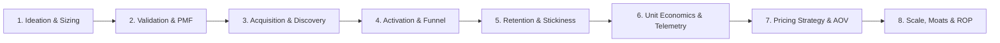

# MentalCraft Business: 8-Stage Venture Lifecycle Intelligence Engine

`Plugin/Business` provides an exhaustive, symmetrical 8-stage commercial intelligence engine for evaluating, launching, and scaling digital and physical ventures across 4 primary commercial modalities.

---

## 🌐 4 Commercial Modalities

| Modality | Key Platforms & Channels | Monetization Models | Primary Focus |
|---|---|---|---|
| **`website`** | Google SERP, Programmatic SEO, Product Hunt, LinkedIn | SaaS Subscriptions ($29–$199/mo), Usage Metering, Stripe Billing | Organic search acquisition, self-serve PLG sandbox, B2B multi-seat expansion |
| **`app`** | Apple App Store, Google Play, Apple Search Ads (ASA), TikTok UGC | Freemium, In-App Purchases (IAP), Auto-renewing subscriptions ($49.99/yr) | App Store Optimization (ASO), Day-0 onboarding paywall quiz, push engagement |
| **`game`** | Steam, Steam Next Fest, Twitch / YouTube Gaming, Discord | Premium Base Game ($19.99), Seasonal Battle Pass ($9.99), DLC, ARPDAU | Wishlist velocity, demo conversion, trailer completion, D1/D7/D30 player retention |
| **`shop`** | Shopify D2C, TikTok Shop, Amazon FBA Prime, Meta Catalog Ads | E-Commerce Physical Goods, Multi-Pack Bundles, VIP Auto-Replenish | Creator affiliates, Add-to-Cart (ATC), Cart abandonment SMS/email, COGS & 3PL, Inventory ROP |

---

## 🏛️ Symmetrical 8-Stage Lifecycle Architecture



### Stage 1: Ideation & Market Sizing
- **`venture_market_validation`**: TAM/SAM/SOM market estimation, competitive intensity (Low/Moderate/High/Fierce), viability score (0–100), recommended monetization model, and key operational risks.
- **`market_niche_discovery`**: Niche forensics by category, seed query, or revenue trajectory.

### Stage 2: Validation & Prototype PMF
- **`venture_pmf_validation`**:
  - Implements the **Sean Ellis 40% Rule** ("How would you feel if you could no longer use the product?").
  - Status classification: `🟢 Strong PMF (>40%)`, `🟡 Moderate Traction (25-40%)`, `🔴 Pivot Required (<25%)`.
  - Analyzes smoke test conversion rate (landing page waitlists, pre-orders, demo downloads), core value proposition validity, and prioritized user feature requests.

### Stage 3: Acquisition & Discovery
- **`venture_acquisition_audit`**: Deep channel audit tailored to each modality:
  - `website`: Organic Google SERP share, Domain Rating (DR), monthly visits, TrafficCV telemetry.
  - `app`: App Store Optimization (ASO) rankings, impression-to-install CTR (%), organic-to-paid ratio.
  - `game`: Steam wishlists volume, daily wishlist velocity, trailer completion %, demo conversion, Next Fest ranking.
  - `shop`: TikTok Shop creator affiliates, blended ROAS, Amazon Sponsored Products ACoS, Google Shopping CPC, Add-to-Cart (ATC) rate.

### Stage 4: Activation & Funnel
- **`venture_activation_funnel`**:
  - Step-by-step onboarding & checkout drop-off analysis.
  - Time-to-Value (TTV) in minutes/seconds.
  - Modality-specific **Aha! Moment Milestones**.
  - Abandoned cart/checkout recovery automation flows (SMS/Email sequences with estimated recovery rate %).

### Stage 5: Retention & Cohort Stickiness
- **`venture_retention_curves`**:
  - Models D1, D7, D14, and D30 cohort retention curves.
  - E-Commerce / Shop 30/60/90-day repurchase rates & repeat customer rates.
  - DAU/MAU stickiness ratio.
  - Benchmark comparison (`Top Quartile` vs `Average` vs `Underperforming`) and monthly churn rate.

### Stage 6: Unit Economics & Telemetry
- **`venture_unit_economics`**:
  - Universal Metrics: CAC, LTV, LTV/CAC ratio ($> 3.0\times$ exceptional), payback period (months), gross margin %.
  - SaaS Metrics: MRR, ARR, ARPU, Net Margin (%).
  - Game Metrics: ARPDAU, Steam platform fee (30%).
  - Shop Metrics: Cost of Goods Sold (COGS), 3PL warehousing & shipping fulfillment, payment gateway cut (2.9% + $0.30), target ROAS, refund/return rate, net profit margin.
- **`venture_monetization_telemetry`**: Multi-provider live billing telemetry across Stripe, Apple App Store, Google Play, Steam, and Shopify Pay.
- **`market_stripe_radar`**: Surging & dark-horse domain revenue leaderboards.
- **`market_site_trajectory`**: Competitor domain checkout and MRR growth curves.
- **`product_traction_score`**: Multidimensional product traction ranking (Market Opportunity, SEO, Revenue Affordance, Moat).

### Stage 7: Pricing Strategy & Optimization
- **`venture_pricing_experiment`**:
  - Price elasticity curves across customizable price points.
  - Expected Revenue Per Visitor ($\text{RPV} = \text{Price} \times \text{Conversion \%}$).
  - Optimal price point recommendation maximizing RPV.
  - Multi-SKU bundle tiering (e.g., Starter, Duo Pack [Save 15%], VIP Bundle [Save 25% + Free Shipping]) to boost Average Order Value (AOV).

### Stage 8: Scale, Expansion & Moats
- **`venture_growth_playbook`**: 90-day sprint roadmap structured into 3 distinct phases (Days 1–30, Days 31–60, Days 61–90) with milestones, deliverables, and target KPIs.
- **`venture_expansion_moat`**:
  - **Virality K-Factor Loop**: $K = i \times c$ (invites per user $\times$ invite conversion rate).
  - Defensive Moats scoring (Network Effects, Switching Costs, Data Flywheel, Brand & Community, Supply Chain & 3PL).
  - **Inventory Reorder Point (ROP)** optimization for e-commerce shops:
    $$\text{ROP} = \text{LTD} + \text{SS} = (d \times L) + (Z \times \sigma_d \times \sqrt{L})$$
    where:
    - $\text{LTD}$ = Lead Time Demand ($d = \text{daily demand}$, $L = \text{lead time in days}$)
    - $\text{SS}$ = Safety Stock ($Z = 1.645$ for 95% service level, $Z = 2.326$ for 99% service level, $\sigma_d = \text{demand standard deviation}$)

---

## ⚡ Specialized Modular Actions

| Action | Provider | Scope & Description | Key Parameters |
|---|---|---|---|
| `seo_keyword_difficulty` | `gefei` | Google SEO KD (0–100), search volume, CPC, and SERP competition | `keyword`, `gl`, `hl`, `force` |
| `seo_batch_keywords` | `gefei` | Multi-keyword opportunity matrix evaluation | `keywords`, `gl`, `hl` |
| `seo_link_budget` | `gefei` | Calculate required backlink quantity and target Domain Rating (DR) | `keyword`, `gl` |
| `traffic_domain_overview` | `trafficcv` | Domain monthly visits, unique visitors, duration, bounce rate, global rank | `domain` |
| `traffic_channel_breakdown` | `trafficcv` | Channel mix (Direct, Organic Search, Referral, Social, Paid, Email) | `domain` |
| `traffic_geo_distribution` | `trafficcv` | Top country geographic traffic distribution | `domain` |
| `traffic_competitor_comparison` | `trafficcv` | Multi-domain traffic benchmark with market leader identification | `domains` |
| `market_stripe_radar` | `gefei` | Stripe Radar monthly revenue leaderboards (dark horses & surging) | `month` (e.g. `202607`) |
| `market_site_trajectory` | `gefei` | Competitor domain historical checkout and referral trends | `domain` |
| `market_niche_discovery` | `auto` | High-revenue whitespace niche opportunities | `query`, `month` |
| `product_traction_score` | `auto` | Multidimensional product commercial viability index | `product_name` |
| `list_actions` | `auto` | List all 21 venture lifecycle capabilities | N/A |

---

## 🔌 MCP JSON-RPC Stdio Server

The plugin includes an MCP-compliant JSON-RPC 2.0 server in `mcp-server.ts`:
- Tool Name: `business`
- Protocol: JSON-RPC 2.0 over standard I/O streams
- Supports: `initialize`, `tools/list`, `tools/call`

Run directly via Bun:
```bash
bun run Plugin/Business/mcp-server.ts
```

---

## 🧪 Testing & Verification

Run the comprehensive unit test suite:
```bash
cd /Users/laiyongzhang/Documents/Holar/Plugin/Business && bun test business.test.ts
```
