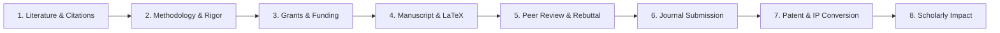

# MentalCraft Science: Academic Production Lifecycle Engine

The `science` plugin manages the end-to-end lifecycle of scientific research, funding acquisition, manuscript authoring, peer review simulation, journal publication, intellectual property protection, and scholarly dissemination across the four core MentalCraft science repositories:
- **`Science/Paper`**: Authoring, literature search, DOI/BibTeX AST validation, manuscript balance auditing, compilation-ready LaTeX generation, and simulated peer review.
- **`Science/Grant`**: NIH/NSF review rubrics, Specific Aims independence validation, and multi-year MTDC budget modeling.
- **`Science/Journal`**: Target journal ranking and Impact Factor matching, 8-point camera-ready submission compliance checklists.
- **`Science/Patent`**: USPTO 35 U.S.C. 101/102/103 novelty analysis, claim tree antecedent basis validation, and patent specification scaffolding.

---

## 🏛️ Symmetrical 8-Stage Academic Production Lifecycle



---

## ⚡ Protocol Actions (19 Actions across 8 Stages)

### Stage 1: Literature & Citation Discovery
- **`paper_literature_search`**: Search indexed peer-reviewed papers, arXiv preprints, DOIs, citation counts, and topic tags.
  - *Parameters*: `query`, `limit`
- **`paper_citation_verify`**: Validate DOI syntax, parse BibTeX records into structured ASTs (verifying required fields per entry type), and format citations across **APA 7th**, **IEEE**, **Nature**, **ACM**, and **Chicago (Author-Date)** styles.
  - *Parameters*: `doi`, `bibtex`, `citation_style`

### Stage 2: Methodology & Reproducibility Design
- **`paper_methodology_audit`**: Audit methodology rigor, compute **statistical power** ($1-\beta \ge 0.80$), calculate **Cohen's d effect size** (Negligible/Small/Medium/Large/Huge), benchmark against a **SOTA baseline matrix**, verify ablation component drops, and assign reproducibility grades (Grade A/B/C).
  - *Parameters*: `manuscript_title`, `methodology_data` (`sample_size`, `treatment_mean`, `control_mean`, `pooled_std`, `baselines`)

### Stage 3: Research Grants & Funding Acquisition
- **`grant_criteria_audit`**: Audit grant proposals against **NIH 5-dimension rubrics** (Significance, Innovation, Approach, Investigators, Environment; 1.0-9.0 scale) or **NSF rubrics** (Intellectual Merit, Broader Impacts; 1.0-5.0 scale).
  - *Parameters*: `funding_agency`, `grant_abstract`
- **`grant_aims_alignment`**: Validate Specific Aims non-contingency, ensuring partial negative outcomes in Aim 1 do not invalidate Aims 2/3, and generate the formal dependency matrix.
  - *Parameters*: `aims`
- **`grant_budget_calculator`**: Calculate multi-year direct costs, personnel fringe benefits (**28%**), Modified Total Direct Costs (**MTDC** exclusions: equipment >$5k, subawards over $25k, participant support), Facilities & Administrative indirect costs (**F&A 52%**), and annual cost-of-living escalation (**3%**).
  - *Parameters*: `duration_years`, `direct_costs`, `fringe_rate_percent`, `indirect_rate_percent`, `annual_escalation_percent`

### Stage 4: Manuscript Authoring & LaTeX / Chinese Scaffolding
- **`paper_structure_audit`**: Audit section completeness (Abstract, Introduction, Related Work, Methodology, Experiments, Discussion, References), target word count proportions, and LaTeX syntax balance.
  - *Parameters*: `manuscript_title`, `manuscript_text`, `sections`
- **`paper_latex_scaffold`**: Generate clean, compilation-ready LaTeX source code for **ACM SIGCONF** (`acmart`) and **IEEE Transactions** (`IEEEtran`) with modern preambles, algorithm blocks, tables, and sample BibTeX entries.
  - *Parameters*: `manuscript_title`, `latex_template` (`"acm"` | `"ieee"`)
- **`chinese_academic_formatter`**: Format Chinese manuscripts according to **GB/T 7714-2015** (journal [J], book [M], conference [C], dissertation [D], online [EB/OL]), standard Chinese 5-tier hierarchical headings (**一、（一）、1、（1）、①**), **CLC classification** (中图分类号, e.g. C91, G206, B84), **document code** (文献标识码 [A]), fund project & author bio footnotes, and bilingual abstracts/keywords.
  - *Parameters*: `chinese_paper` (`title`, `clc_code`, `document_code`, `fund_project`, `author_bio`, `headings`, `chinese_abstract`, `chinese_keywords`, `references`)

### Stage 5: Simulated Peer Review & Rebuttal
- **`paper_peer_review_simulate`**: Simulate a diverse 3-reviewer expert panel (Theoretical Foundations, Systems Architecture, Applications & Reproducibility) with criteria ratings (1-10), reviewer confidence (1-5), consensus recommendation, and a comprehensive point-by-point rebuttal matrix.
  - *Parameters*: `manuscript_title`, `manuscript_text`
- **`social_science_peer_review_audit`**: Rigorous peer review evaluation for Chinese **CSSCI top journals** (《中国社会科学》《社会学研究》《心理学报》《管理世界》《新闻与传播研究》) and English **SSCI Q1 journals** (Nature Human Behaviour, Computers in Human Behavior, New Media & Society) evaluating theoretical conceptualization, **empirical triangulation** ($N \ge 1000$ quantitative survey + $N \ge 30$ qualitative fieldwork interviews), common method bias (CMB), theoretical saturation, ethical reflexivity, and endogeneity identification strategies.
  - *Parameters*: `manuscript_title`, `target_cssci_journal`, `target_ssci_journal`, `empirical_data`

### Stage 6: Target Journal Matching & Camera-Ready Submission
- **`journal_matcher`**: Match research manuscripts against indexed JCR/Scimago venues by Impact Factor, H-index, acceptance rate, review turnaround weeks, and Open Access model (Gold, Hybrid, Diamond).
  - *Parameters*: `field_of_study`, `desired_impact_factor_min`, `target_review_weeks_max`, `open_access_preference`
- **`journal_submission_checklist`**: Comprehensive 8-point camera-ready pre-submission audit (CRediT, Data/Code, Ethics, Figures, LaTeX margins, COI, Cover Letter).
- **`ssci_top_journal_matcher`**: Specialized matching against premier **SSCI Q1 venues** (*Nature Human Behaviour*, *Computers in Human Behavior*, *New Media & Society*, *Information, Communication & Society*, *Journal of Communication*, *Information Systems Research*, *Annual Review of Sociology*, *Journal of Computer-Mediated Communication*, *Telematics and Informatics*) with exact IF, acceptance rates, word limits, turnaround times, and APA 7th / OSF pre-registration requirements.
  - *Parameters*: `social_science_field`, `desired_impact_factor_min`, `target_review_weeks_max`, `word_count_limit_max`, `open_access_preference`

### Stage 7: Intellectual Property & Patent Conversion
- **`patent_novelty_check`**: Evaluate invention patentability under US Patent Law:
  - **35 U.S.C. § 101**: Subject matter eligibility & Alice/Mayo technical transformation.
  - **35 U.S.C. § 102**: Single-reference prior art novelty anticipation.
  - **35 U.S.C. § 103**: Non-obviousness and unexpected synergistic technical advantages.
  - *Parameters*: `invention_title`, `invention_summary`
- **`patent_claim_structure`**: Audit independent/dependent claim hierarchy and verify **35 U.S.C. § 112 antecedent basis** (detecting missing indefinite antecedents for definite noun and step references).
  - *Parameters*: `claims_text`, `claims_list`
- **`patent_spec_scaffold`**: Scaffold formal 9-section USPTO/WIPO specification document (Title, Cross-Reference, Field, Background, Summary, Drawing Descriptions, Detailed Embodiments, Claims, Abstract).
  - *Parameters*: `invention_title`

### Stage 8: Scholarly Impact & Dissemination
- **`scholarly_impact_forecast`**: Forecast 3-year citation velocity trajectories, project Altmetric Attention Scores with channel breakdowns (Twitter/X, News, Policy, Reddit/Hacker News, Wikipedia), outline multi-tier dissemination strategies, and audit open-source reproducible artifact checklists.
  - *Parameters*: `manuscript_title`

### Core Discovery
- **`list_actions`**: Return the complete inventory of all 19 academic production actions structured across the 8 lifecycle stages.

---

## 🔌 Model Context Protocol (MCP) Integration

The Science plugin provides native JSON-RPC 2.0 stdio MCP server support in `Plugin/Science/mcp-server.ts`.

```json
{
  "jsonrpc": "2.0",
  "id": 1,
  "method": "tools/call",
  "params": {
    "name": "science",
    "arguments": {
      "action": "grant_budget_calculator",
      "duration_years": 3,
      "fringe_rate_percent": 28,
      "indirect_rate_percent": 52,
      "direct_costs": {
        "personnel": 240000,
        "equipment": 45000,
        "supplies": 15000,
        "travel": 12000
      }
    }
  }
}
```

---

## 🧪 Testing & Verification

Execute the test suite with Bun:

```bash
cd Plugin/Domain/Science
bun test science.test.ts
```
